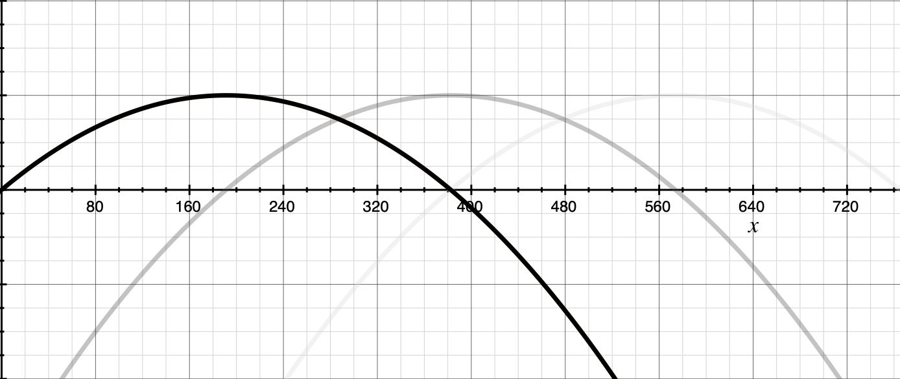

# canvas-hms
A super lightweight library for setting the highlights, midtones and shadows for images drawn on HTML5 Canvas.

## Install
```
npm install canvas-hms
```

## Import
#### ES6/Babel
```javascript
import HMS from "canvas-hms";
```

#### ES5
```javascript
const HMS = require("canvas-hms");
```

## Usage
```javascript
// Do some canvas magic...
context.drawImage(myImage, 0, 0, canvas.width, canvas.height);

const options = {curveWidth: 765 / 3};
const hms = new HMS({canvas: myCanvasElement, options});

hms.setHighlights(30);
hms.setMidtones(15);
hms.setShadows(-15);
```

#### Before


#### After


## How it works
The equation used is a cheap approximation of a tone curve.

#### Tone curve example


#### Approximation
